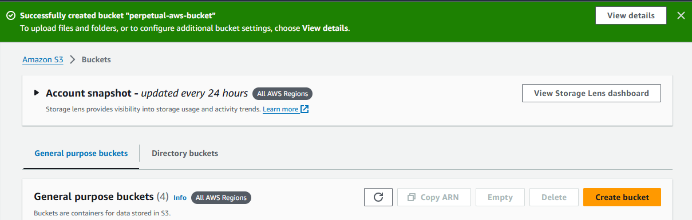

# Hosting a simple website on AWS s3

## Overview

This is a brief description of how to host a simple website on AWS Simple Storage Service. 

## Prerequisites

Make sure you have the following prerequisites;

- [AWS Account setup](https://console.aws.amazon.com/console/home)

## How to Host a simple website on s3

- **Sign in to AWS Console**

Using your AWS account credentials (username and password), log into the AWS Management Console.

- **Create an S3 bucket**

On the management console, search for s3 and click on the _Create Bucket_ buttton. 

Specify a unique name for your bucket

Enable the ACLs and uncheck the box to _Block all public access_

You can optionally enable versioning and create tags

Select the encryption type (Server-side encryption, SSE with AWS KMS)

You can decide to enable Object Lock to lock the object to prevent it from accidental deletion or overwrite. Enabling Object Lock automatically enables Versioning.

Your Bucket is created successfully

- **Configure Bucket Properties**

- Select your bucket from the list of buckets and scroll all the way to static web hosting, then click on the _Edit_ button.

- Enable static web hosting, then specify the index file and click on the _Save changes_ button.

- Go back to the _Objects_ tab and click on Upload

- Upload the folder containing the files for the website

- Go back to the Properties tab and scroll down to static web hosting. A website url link would be provided. The link would direct users to your website.

## Website URL

Here is the link to the deployed website on AWS s3

## _Thank you for reading_

