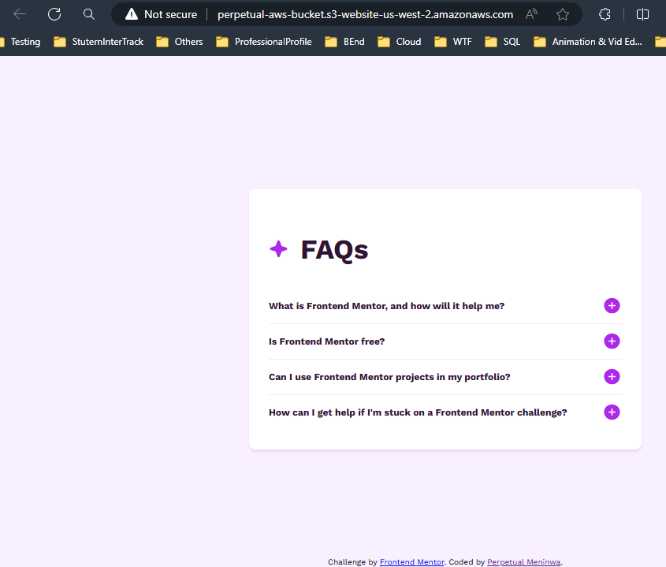
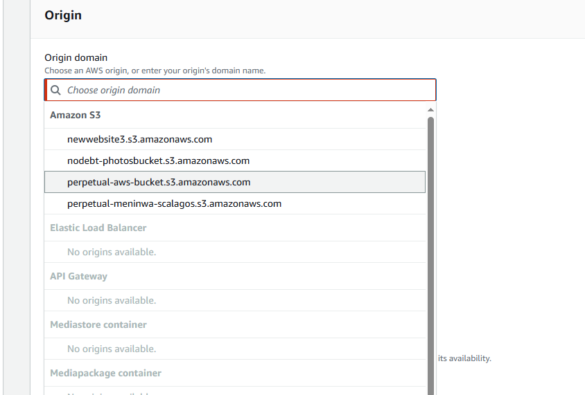

# Hosting a simple website on AWS s3

## Overview

This is a brief description of how to host a simple website on AWS Simple Storage Service. 

## Prerequisites

Make sure you have the following prerequisites;

- [AWS Account setup](https://console.aws.amazon.com/console/home)

## How to Host a simple website on s3

- **Sign in to AWS Console**

Using your AWS account credentials (username and password), log into the AWS Management Console.

- **Create an S3 bucket**

On the management console, search for s3 and click on the _Create Bucket_ buttton. 

Specify a unique name for your bucket

Enable the ACLs and uncheck the box to _Block all public access_

You can optionally enable versioning and create tags

Select the encryption type (Server-side encryption, SSE with AWS KMS)

You can decide to enable Object Lock to lock the object to prevent it from accidental deletion or overwrite. Enabling Object Lock automatically enables Versioning.

Your Bucket is created successfully

- **Configure Bucket Properties**

- Select your bucket from the list of buckets and scroll all the way to static web hosting, then click on the _Edit_ button.

- Enable static web hosting, then specify the index file and click on the _Save changes_ button.

- Go back to the _Objects_ tab and click on Upload

- Upload the folder containing the files for the website

- Go back to the Properties tab and scroll down to static web hosting. A website url link would be provided. The link would direct users to your website.

## Website URL

Here is the link to the deployed website on AWS s3

[AWS s3 Deployed URL](http://perpetual-aws-bucket.s3-website-us-west-2.amazonaws.com/)

## Using AWS CloudFront to deliver content for low-latency

For this purpose of this presentation, I would be using the AWS Management Console, but you can also use _AWS SDKs_, _CloudFront API_, _AWS CLI_, and _Windows PowerShell tool_

- Search for CloudFront from Services tab on the AWS Management Console

- Click on the _Create a CloudFront distribution_ button. At this time, you must have created an s3 bucket and hosted your website as discussed in the previous topics. [Hosting a website on S3](https://github.com/Perpy-del/sca_cloud_s3_website?tab=readme-ov-file#how-to-host-a-simple-website-on-s3)

- For Origin, Origin domain, choose the S3 bucket that you created

- For Web Application Firewall (WAF), select one of the options. The _Enable Security settings_ will cost you. Selecting the other cost you nothing.

- For all other sections and settings, accept the default values. Then choose _Create distribution_

- When your distribution is done deploying, the Last modified field changes from Deploying to a date and time.

- Record the domain name that CloudFront assigns to your distribution. It looks similar to the following: d111111abcdef8.cloudfront.net.

## CloudFront Website URL

Here is the link to the deployed website on AWS CloudFront

[AWS CloudFront URL](https://d2ma1n9qaokle.cloudfront.net/)

It looks just the same as the deployed s3 bucket website but this is the cached version and it reduces latency.

## _Thank you for reading_

